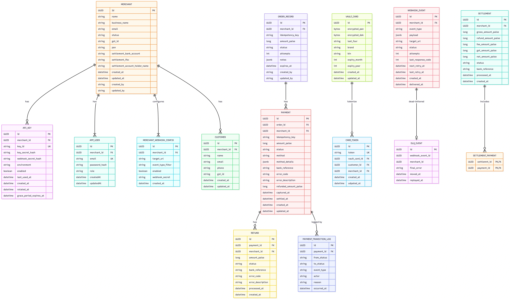

# payment-gateway-backend

A production-oriented payment gateway backend inspired by modern fintech systems such as Razorpay.

The long-term goal of this project is to evolve into a **distributed payment processing platform** capable of handling merchant onboarding, payment processing, refunds, settlements, webhook delivery, reconciliation, and event-driven workflows at scale.

The project currently follows a **Modular Monolith Architecture** built with **Java 25** and **Spring Boot 4**, allowing domain boundaries to be clearly defined before extraction into independent microservices.

---

## Vision

Build a scalable payment infrastructure that demonstrates backend engineering concepts including:

* Domain-driven design
* Modular architecture
* Payment lifecycle management
* Idempotent APIs
* Settlement processing
* Webhook delivery and retries
* Event-driven communication
* Distributed systems patterns
* Microservice decomposition

---

## Current Architecture

### Phase 1 – Modular Monolith (Current)

Modules are organized around business domains:

* Merchant Management
* Order Management
* Payments
* Refunds
* Settlements
* Customer Management
* Tokenization
* Webhooks
* Reconciliation & Audit

### Phase 2 – Distributed System (Planned)

Planned migration into independently deployable services:

* Merchant Service
* Payment Service
* Refund Service
* Settlement Service
* Webhook Service
* Notification Service

Communication will gradually move toward asynchronous event-driven workflows using Kafka.

---

## Technology Stack

* Java 25
* Spring Boot 4
* Spring Data JPA
* PostgreSQL
* Maven
* Docker
* Kafka (Planned)
* Redis (Planned)
* JWT Authentication (Planned)

---

## Database Schema

The platform is designed around real-world payment gateway entities such as:

* Merchant
* API Keys
* Orders
* Payments
* Refunds
* Customers
* Card Tokens
* Settlements
* Webhook Events
* Dead Letter Queue Events

---

## Learning Goals

This project serves as a hands-on exploration of:

* Enterprise Backend Development
* FinTech Domain Modeling
* Distributed Systems
* Event-Driven Architecture
* High-Scale System Design
* Production-Ready Spring Boot Development

---

## Status

🚧 Active Development

Currently implementing the Merchant Onboarding module and foundational payment gateway workflows.
